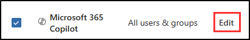

# Lab – Prevent data exposure in Copilot and AI apps with data loss prevention

Megan Bowen, the Information Security Administrator at Contoso Ltd., is strengthening protections as the company expands its use of Microsoft 365 Copilot. Leadership wants to reduce the risk of sensitive information being processed by Copilot or shared with external AI tools. To meet this goal, Megan will configure data loss prevention (DLP) policies that keep highly confidential project data out of Copilot and prevent regulated personal data from being pasted or uploaded to AI websites.

**Tasks**:

1. Create a DLP policy in simulation mode
1. Activate a policy in simulation mode
1. Create an endpoint DLP policy

## Task 1 – Create a DLP policy in simulation mode

In this task, you'll create a data loss prevention (DLP) policy that restricts Microsoft 365 Copilot from processing content labeled as highly confidential.

1. Log into Client 1 VM (SC-401-CL1) with the **Admin** account.

1. Open Microsoft Edge.

1. In **Microsoft Edge**, navigate to `https://purview.microsoft.com` and sign in as **Megan Bowen** (`MeganB@WWLxZZZZZZ.onmicrosoft.com`, where ZZZZZZ is your unique tenant ID). Use the password provided by your lab host.

1. Select **Get started** on the welcome message for the new Microsoft Purview portal.

    

1. From the left sidebar, select **Solutions** > **Data Loss Prevention** > **Policies**.

1. On the **Policies** page, select **+ Create policy** to start the configuration for creating a new data loss prevention policy.

1. On the **Choose what type of data to protect** page, select **Data stored in connected sources**, then select **Next**.

1. On the **Start with a template or create a custom policy** page, select **Custom** as the category, then select **Custom policy** under **Regulations**.

1. Select **Next**.

1. On the **Name your DLP policy** page enter:

   - **Name**: `Copilot restrict highly confidential data`
   - **Description**: `Restricts Copilot from processing content labeled Highly Confidential.`

1. Select **Next**.

1. On the **Assign admin units** page select **Next**.

1. On the **Choose locations to apply the policy** page, select the location for **Microsoft 365 Copilot** only. If any other locations are selected, deselect them.

1. On the **Choose locations to apply the policy**, in the **Actions** column for Microsoft 365 Copilot, select **Edit** to change the scope.

    

1. On the **Scope for Copilot for Microsoft 365 (preview)** flyout:

   - Select **Specific users and groups**
   - Under **Specific users and groups**, select **Include** > **Include groups**
   - On the **Choose groups** flyout, select the checkbox for **Mark 8 Project Team**
   - Select **Done** at the bottom of the **Choose groups** flyout
   - Select **Done** at the bottom of the **Scope for Copilot for Microsoft 365 (preview)** flyout

1. Back on the **Choose where to apply the policy** page, select **Next**.

1. On the **Define policy settings** page, leave the default **Create or customize advanced DLP rules** selected, then select **Next**.

1. On the **Customize advanced DLP rules** page, select **+ Create rule**.

1. In the **Create rule** flyout, in the **Name** field, enter `Restrict Copilot highly confidential`.

1. Under **Conditions**, select **+ Add condition** > **Content contains**.

1. In the **Content contains** section, select **Add** > **Sensitivity labels**.

   

1. In the **Sensitivity labels** flyout, select the checkbox for **Highly Confidential**, then select **Add** at the bottom of the flyout.

1. Back on the **Create rule** flyout, under **Actions** select **+ Add an action** > **Restrict Copilot from processing content**.

1. Select **Save** at the bottom of the **Create rule** flyout.

1. Back on the **Customize advanced DLP rules** page, select **Next**

1. On the **Policy mode** page select **Run the policy in simulation mode**, then select both checkboxes:

   - Show policy tips while in simulation mode
   - Turn the policy on if it's not edited within fifteen days of simulation

1. Select **Next**.

1. On the **Review and finish** page review your settings then select **Submit**.

1. On the **New policy created** page select **Done**.

You've created a DLP policy in simulation mode that prevents Copilot from processing highly confidential content.

## Task 2 – Activate a policy in simulation mode

In this task, you'll activate the Copilot DLP policy and explore the insights available in simulation mode.

1. On the **Policies** page select the **Copilot restrict highly confidential data** policy.

1. At the bottom of the flyout on the right, select **View simulation**.

1. On the simulation page, take a moment to explore:

   - The **Simulation overview** tab, which shows scanning progress, total matches, and scanning status by location.
   - The **Items for review tab**, where any predicted matches will appear once available.
   - The **Alerts tab**, where any alerts triggered in simulation mode would be listed.

1. After exploring the insights in simulation mode, select **Turn the policy on** then **Confirm** to activate the DLP policy.

   A confirmation flyout will appear indicating that the policy has been published successfully.

You've activated the Copilot DLP policy, moving it from simulation mode to active enforcement.

## Task 3 – Create an endpoint DLP policy

In this task, you'll create an endpoint DLP policy that blocks users from pasting or uploading banking data, such as credit card numbers and routing information, into AI websites.

1. On the **Policies** page of the **Data Loss Prevention** solution of the Microsoft Purview portal, select **+ Create policy**.

1. On the **Choose what type of data to protect** page, select **Data stored in connected sources**, then select **Next**.

1. On the **Start with a template or create a custom policy** page, select **Custom** and **Custom policy**, then select **Next**.

1. On the **Name your DLP policy** page, enter:

    - **Name**: `Block AI website uploads of banking data`
    - **Description**: `Prevent users from pasting or uploading banking information, such as credit card or routing numbers, to AI websites.`

1. Select **Next**.

1. On the **Assign admin units** page, select **Next**.

1. On the **Choose locations to apply the policy** page, ensure only the **Devices** location is selected. If any other location is selected, ensure they're deselected, then select **Next**.

1. On the **Define policy settings** page, select **Create or customize advanced DLP rules** then select **Next**.

1. On the **Customize advanced DLP rules** page, select **+ Create rule**.

1. In the **Create rule** flyout, in the **Name** field, enter `Block banking data exposure to AI websites`.

1. Under **Conditions** select **+ Add condition** then select **Content contains**.

1. In the new **Content contains** section:

    - Select **Add** > **Sensitive info types**.
    - In the **Sensitive info types** flyout, search for these sensitive info types:
       - `Credit Card Number`
       - `ABA Routing Number`
       - `SWIFT Code`
       - `International Banking Account Number (IBAN)`
    - Select **Add** at the bottom of the flyout

1. Under **Actions**, select **+ Add an action** > **Audit or restrict activities on devices**.

1. In the **Service domain and browser activities** section:

   1. Select the checkbox for **Upload to a restricted cloud service domain or access from an unallowed browser**.

   1. Next to this option, select **+ Choose different restrictions for sensitive service domains**.

   1. In the **Sensitive service domain restrictions** flyout:

      - Select **+ Add group**.
      - In the **Choose sensitive service domain groups** flyout, select the checkbox for **Generative AI Websites**, then select **Add**.
      - Back on the **Sensitive service domain restrictions** flyout, select **Save**.

   1. In the **Create rule** flyout, under **Upload to a restricted cloud service domain or access from an unallowed browser**, set the restriction to **Block**.

1. In the same **Service domain and browser activities** section:

   1. Select the checkbox for **Paste to supported browsers**.

   1. Next to this option, select **+ Choose different restrictions for sensitive service domains**.

   1. In the **Sensitive service domain restrictions** flyout:

      - Select **+ Add group**.
      - In the **Choose sensitive service domain groups** flyout, select the checkbox for **Generative AI Websites**, then select **Add**.
      - Back on the **Sensitive service domain restrictions** flyout, select **Save**.

   1. In the **Create rule** flyout, under **Paste to supported browsers**, set the restriction to **Block**.

1. Under **User notifications**:

    - Turn **On** the toggle for **Use notifications to inform your users and help educate them on the proper use of sensitive info.**.
    - Select the checkbox to **Show users a policy tip notification when an activity is restricted**.

1. Select **Save** at the bottom of the **Create rule** flyout.

1. Back on the **Customize advanced DLP rules**, select **Next**.

1. On the **Policy mode** page select **Turn the policy on immediately**.

1. Select **Next**.

1. On the **Review and finish** page, review your policy settings then select **Submit** to create the policy.

1. Once the policy is created select **Done** on the **New policy created** page.

You've created an endpoint DLP policy that blocks banking data from being pasted or uploaded into AI websites.

## Lab complete

You created a DLP policy that keeps highly confidential project content out of Microsoft 365 Copilot, tested it in simulation mode, and then activated it for enforcement. You also added an endpoint policy that blocks banking data, such as credit card and routing numbers, from being pasted or uploaded to AI websites. Together, these safeguards reduce the chance that Copilot or external AI tools process Contoso's sensitive or regulated data.

If you'd like to extend this scenario, continue to the bonus task to use Adaptive Protection so these safeguards apply dynamically based on insider risk signals.
